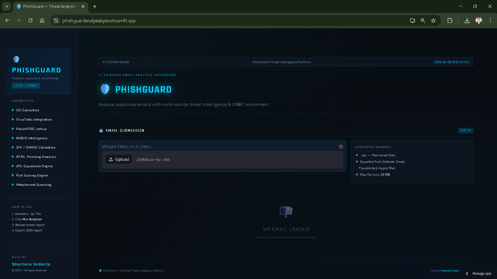

# 🛡️ PhishGuard — Phishing Email Threat Analysis Platform

🚀 A full-stack cybersecurity tool for automated phishing email analysis using threat intelligence, OSINT, and risk scoring.

## 📸 Dashboard Preview

---

## 🌐 Live Demo
👉 https://phishguardanalysisbysv.streamlit.app/

---

## 📌 Overview

PhishGuard is an advanced phishing email analysis platform that simulates real-world SOC (Security Operations Center) workflows.

It automates:
- Email parsing
- IOC extraction
- Threat intelligence enrichment
- Phishing detection
- Risk scoring

The platform is designed to help security analysts quickly triage suspicious emails and make informed decisions.

---

## ⚙️ Key Features

### 🔍 Email Analysis
- Parses `.eml` files
- Extracts headers, body, and attachments

### 📊 IOC Extraction
- URLs
- IP addresses
- Domains
- Attachments (SHA256 hashing)

### 🌐 Threat Intelligence Integration
- VirusTotal API → URL & IP reputation
- AbuseIPDB API → IP abuse scoring
- WHOIS Lookup → domain intelligence

### 📧 Email Authentication Checks
- SPF validation
- DMARC policy analysis

### 🧠 Phishing Detection
- HTML link mismatch detection
- Suspicious domain identification
- URL shortener detection

### 🚨 Risk Scoring Engine
- Aggregates multiple signals
- Classifies threats:
  - 🔴 HIGH
  - 🟡 MEDIUM
  - 🟢 LOW
- Provides reasoning for decisions

### 🎨 Interactive Dashboard (Streamlit)
- Cyber-themed UI
- Real-time analysis flow
- Visual threat insights
- Downloadable reports

---

## 🏗️ Architecture

Email Input (.eml)
        ↓
Email Parser
        ↓
IOC Extractor
        ↓
Threat Intelligence Layer
(VirusTotal, AbuseIPDB, WHOIS)
        ↓
Phishing Detection Engine
        ↓
Risk Scoring Engine
        ↓
Streamlit Dashboard UI

---

## 🛠️ Tech Stack

- Python
- Streamlit
- VirusTotal API
- AbuseIPDB API
- BeautifulSoup
- pandas / matplotlib
- python-whois / dnspython

---

## 📂 Project Structure

phishing-analyzer/
│
├── app.py
├── main.py
├── requirements.txt
│
├── parser/
├── intel/
├── analysis/
├── utils/
├── report/
└── samples/

---

## 🔑 Setup & Installation

git clone https://github.com/yourusername/phishing-analyzer.git
cd phishing-analyzer

python -m venv venv
venv\Scripts\activate

pip install -r requirements.txt

---

## ▶️ Run Locally

streamlit run app.py

---

## 👨‍💻 Author

Shantanu Vedante  
Cybersecurity Enthusiast / Msc Cyber Security Student 

---

## 📜 License

© 2026 Shantanu Vedante. All rights reserved.
